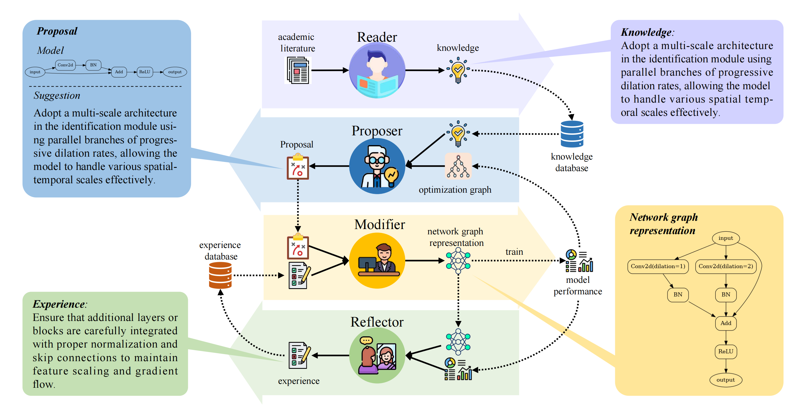

# NADER: Neural Architecture Design via Multi-Agent Collaboration

This is official implementation for "NADER: Neural Architecture Design via Multi-Agent Collaboration" (CVPR2025)

## 📖 Overview

<p align="center">
  
</p>

## 🎉 News

April. 26, 2025: NADER is now open source.

## 💻️ Get Started

### Installation the environment

### Download Datasets

### Run


## 📝 Citation
To cite NADER in publications, please use the following BibTeX entrie.
```bibtex
@misc{yang2024naderneuralarchitecturedesign,
      title={NADER: Neural Architecture Design via Multi-Agent Collaboration}, 
      author={Zekang Yang and Wang Zeng and Sheng Jin and Chen Qian and Ping Luo and Wentao Liu},
      year={2024},
      eprint={2412.19206},
      archivePrefix={arXiv},
      primaryClass={cs.CV},
      url={https://arxiv.org/abs/2412.19206}, 
}
```
